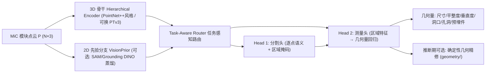

# 任务感知双头框架设计（Task-Aware Dual-Head Framework）

> 代码实现见 `project1/`（models/ 各模块一一对应本文档）
> 框架命名（报告用）：**TADH-MiC**（Task-Aware Dual-Head network for MiC geometric measurement）

## 1. 总体架构

## 2. 模块设计

### 2.1 输入预处理
- 平移至质心、按 `normalize_scale` 缩放（真值按同一变换换算）
- 若逐点颜色/特征存在则拼接到输入

### 2.2 3D 骨干（`models/backbone.py`）
- **默认实现**：PointNet++ 风格分层编码器（FPS + ball query + 共享 MLP + max-pool），3 层 set-abstraction 输出多尺度逐点特征（拼接粗层插值特征）
- 无 MinkowskiEngine 依赖，CPU/GPU 均可运行；**可选升级**：pointcept PTv3 作为 drop-in 替换（预留接口 `backbone: ptv3` 的配置位，文档说明安装方式）
- 输出：逐点特征 F ∈ R^{N×D}

### 2.3 2D 视觉先验分支（`models/vision_prior.py`，可选）
- 接口：`VisionPrior.prior_masks(points, images) -> (point_masks, point_feats)`
- `NullPrior`（默认，零先验，保证无重依赖可运行）
- `SAMPrior`：对模块 RGB 图像跑 SAM 自动掩码 → 将掩码投影到点云（相机内参标定后）→ 得到"部件候选先验"拼入逐点特征；权重冻结 + 轻量投影适配器
- 对应项目要求 "Foundation-based models are welcome to use"；消融开关 `use_vision_prior`

### 2.4 任务感知路由（`models/heads.py` 中的 TaskRouter）
- 全局 max-pool 骨干特征 → MLP → 6 类任务 logits（T1–T6）
- 任务嵌入 $e_{task}$ = 任务嵌入表按 logits 的 soft 加权和（软路由，可梯度回传）
- 通过 FiLM 风格调制：对分割头/测量头的中间特征做仿射变换 $(1+\gamma)\odot f + \beta$，$(\gamma,\beta)$ 由 $e_{task}$ 线性生成
- 训练用样本主任务标签监督（CE）；推理时 soft 权重天然支持多任务组合

### 2.5 Head 1：检测/分割头（`models/heads.py` 中的 SegHead）
- 逐点 MLP（2 层 + BN）→ 8 类语义 logits（background / wall / floor / ceiling / door / window / hole / embedded）
- 区域掩码：argmax 后连通域分组得到实例区域（洞口/孔洞/预埋件通常空间独立，语义分组即可满足测量需求；报告说明与 Mask3D 式实例头的取舍）
- 损失：CE + Dice

### 2.6 Head 2：几何测量头（`models/heads.py` 中的 MeasureHead）
- 对每个语义类 c，用 soft mask（seg logits 的 softmax 权重）在逐点特征上加权池化 → 区域特征 $r_c$
- $r_c$ 与任务嵌入拼接 → 共享 MLP + 每类输出头 → 每类测量向量 $m_c$（固定槽位，见 2.7）与有效掩码 $v_c$
- 损失：对有效槽位的 SmoothL1（毫米级回归）
- **推断期混合精修**：以预测掩码为输入运行 `geometry/` 确定性测量（RANSAC 平面、包围盒、圆拟合），学习头输出用于初始化/残差修正——报告中对"学习式 vs 纯几何"做消融

### 2.7 测量槽位定义（与数据生成器共用，`geometry/measures.py`）
| 类 | 槽位 [dim1, dim2, dim3, deviation] |
|----|-----------------------------------|
| wall | 长度, 高度, —, 平整度残差 max |
| floor | 长度, 宽度, —, 平整度残差 max |
| ceiling | 长度, 宽度, —, 平整度残差 max |
| door | 宽度, 高度, —, 边缘直线度 |
| window | 宽度, 高度, —, 边缘直线度 |
| hole | 直径, 直径, —, 圆拟合残差 |
| embedded | 宽度, 高度, 凸出高度, 位置偏差 |

模块级 L/W/H 由墙/地类推导；垂直度 = 相邻面法向量夹角（由 wall 掩码几何计算）；对角线 = √(L²+W²+H²)。

### 2.8 损失函数与训练策略（`train.py`）
- 总损失：$L = \lambda_{seg} L_{seg} + \lambda_{task} L_{task} + \lambda_{meas} L_{meas}$（默认 1.0 / 0.5 / 1.0）
- 课程学习：第 1 阶段冻结测量头仅训分割+路由（warmup_epochs，默认 5）；第 2 阶段联合训练
- AdamW + cosine schedule；`configs/default.yaml` 可配全部超参

## 3. 与 SOTA 的差异点（报告创新性表述）

1. **端到端双头**：分割与测量联合优化，缓解"分割→拟合"两阶段误差传播（vs Deng 2026 / Shu 2023 / Wan 2025 串行范式）
2. **任务感知路由**：首次将 task-aware 软路由引入 MiC 质检，单一网络覆盖 6 类检测任务（vs Li D 2022 等单任务专用系统）
3. **2D 基础模型可插拔融合**：SAM/Grounding DINO 先验经投影适配器进入 3D 管线（vs 现有土木应用止步于 2D 分割）
4. **混合测量**：学习回归 + 确定性几何精修，兼顾精度与可解释性/合规判定

## 4. 实验设计（详见 docs/experiments.md）

- 主实验：合成 MiC 数据上 几何基线 vs 双头框架（各任务 MAE/RMSE）
- 消融：w/o 任务路由（共享头）、w/o 2D 先验、w/o 几何精修、单头（仅几何）vs 双头
- 泛化：不同模块类型（6 类）、噪声强度、遮挡比例下的稳健性
- 迁移：STPLS3D 预训练（可选，GPU 资源允许时）

## 5. 技术栈与依赖

- Python 3.11、PyTorch ≥2.1、numpy、PyYAML（核心仅此三者）
- 可选：segment-anything + 权重（2D 先验分支）、MinkowskiEngine/pointcept（PTv3 升级）、open3d（可视化辅助）
